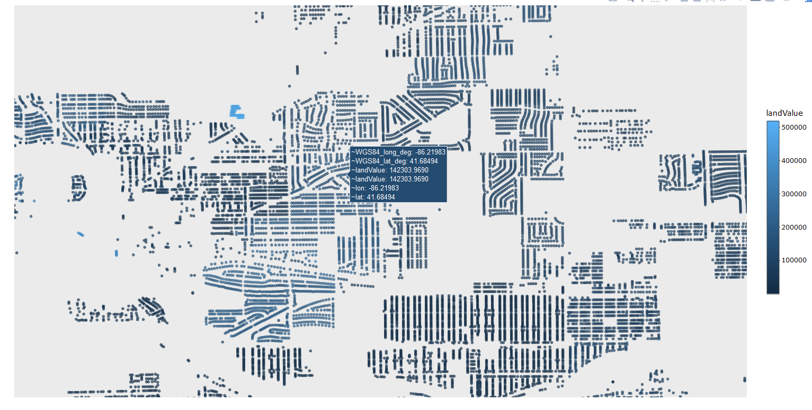
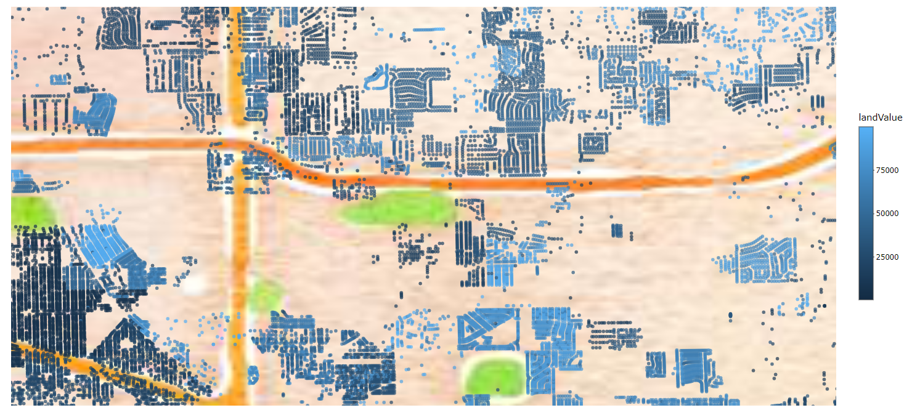

```{r setup, include=FALSE}
knitr::opts_chunk$set(echo = FALSE, message = FALSE, warning = FALSE, comment = "")

library(dplyr)

library(plotly)

load("data/Flat2017Joined.RData")

load("data/tractJoiner.RData")

load("data/salesOnly2017.RData")

load("data/sales2013Data.RData")

load("data/sales2014Data.RData")

load("data/sales2015Data.RData")

load("data/sales2016Data.RData")

source("code/codFunction.R")
```

# 2017 Sales

## Initial Model

For an initial pass, we constructed a model in which valid sales prices were predicted by land and improvement values. The values taken from this baseline model were then used to calculate updated assessed values.

```{r}
saleCoef = Flat2017 %>% 
  filter(!is.na(`Sale Price`)) %>% 
  mutate() %>% 
  lm(`Sale Price` ~ land_AV_preRoll + improvement_AV_preRoll -1, data = .) %>% 
  coef()

updatedDat = Flat2017 %>% 
  filter(!is.na(`Sale Price`)) %>% 
  mutate(newAssessedValue = (land_AV_preRoll * saleCoef["land_AV_preRoll"]) + 
           (improvement_AV_preRoll * saleCoef["improvement_AV_preRoll"]), 
         saleAssessedDiff = `Sale Price` - newAssessedValue, 
         saleAssessedDiffPerc = (`Sale Price` - newAssessedValue) / `Sale Price`, 
         ratio = newAssessedValue / `Sale Price`, 
         medianRatio = median(ratio), 
         dispersion = ratio - medianRatio)
  
knitr::kable(rbind(COD = ((100/nrow(updatedDat)) * sum(abs(updatedDat$dispersion))) / updatedDat$medianRatio[1], 
                   Ratio = mean(updatedDat$medianRatio)), caption = "Base Results")

```

With a very basic model, we were able to achieve reasonable values on both COD and Ratio.

## Existing Neighborhood Results

As a next step, we computed individual regressions for each pre-existing neighborhood with at least 5 sales.

Min = 5

```{r}
testFunc(salesOnly, Flat2017, 5, type = "full", "neighborhood") %>% 
  knitr::kable(., caption = "Neighborhood Results")
```


Min = 3

```{r}
testFunc(salesOnly, Flat2017, 3, type = "full", "neighborhood") %>% 
  knitr::kable(., caption = "Neighborhood Results")
```


## New Neighborhoods (Individual Distance)

Min = 5

```{r}
testFunc(salesOnly, Flat2017, 5, type = "full", "new_neighborhood_ind") %>% 
  knitr::kable(., caption = "Neighborhood Results")
```


Min = 3

```{r}
testFunc(salesOnly, Flat2017, 3, type = "full", "new_neighborhood_ind") %>% 
  knitr::kable(., caption = "Neighborhood Results")
```


## New Neighborhoods (Midpoint Distance)

Min = 5

```{r}
testFunc(salesOnly, Flat2017, 5, type = "full", "new_neighborhood_mid") %>% 
  knitr::kable(., caption = "Neighborhood Results")
```


Min = 3

```{r}
testFunc(salesOnly, Flat2017, 3, type = "full", "new_neighborhood_mid") %>% 
  knitr::kable(., caption = "Neighborhood Results")
```


## School Districts

Min = 5

```{r}
testFunc(salesOnly, Flat2017, 5, type = "full", "school_district") %>% 
  knitr::kable(., caption = "School District Results")
```


Min = 3

```{r}
testFunc(salesOnly, Flat2017, 3, type = "full", "school_district") %>% 
  knitr::kable(., caption = "School District Results")
```

## Tax Districts

Min = 5

```{r}
testFunc(salesOnly, Flat2017, 5, type = "full", "tax_district") %>% 
  knitr::kable(., caption = "Tax District Results")
```


Min = 3

```{r}
testFunc(salesOnly, Flat2017, 3, type = "full", "tax_district") %>% 
  knitr::kable(., caption = "Tax District Results")
```

## Township

Min = 5

```{r}
testFunc(salesOnly, Flat2017, 5, type = "full", "township") %>% 
  knitr::kable(., caption = "Township Results")
```


Min = 3

```{r}
testFunc(salesOnly, Flat2017, 3, type = "full", "township") %>% 
  knitr::kable(., caption = "Township Results")
```

## Tract

In an attempt to find an additional way to create neighborhoods, we also used Census Tracts.

Min = 5

```{r}
testFunc(salesOnly, Flat2017, 5, type = "full", "tract") %>% 
  knitr::kable(., caption = "Tract Results")
```


Min = 3

```{r}
testFunc(salesOnly, Flat2017, 3, type = "full", "tract") %>% 
  knitr::kable(., caption = "Tract Results")
```

## Combined 

After examining individual geographical areas, we made an effort to nest geographical features into two levels.

### School District & Township
```{r}
testFunc(salesOnly, Flat2017, 5, type = "full", "school_district", "township") %>% 
  knitr::kable(., caption = "School District & Township Results")
```

### Township & Tax District

```{r}
testFunc(salesOnly, Flat2017, 5, type = "full", "township", "tax_district") %>% 
  knitr::kable(., caption = "Township & Tax District Results")
```

### Tax District & Tract

```{r}
testFunc(salesOnly, Flat2017, 5, type = "full", "tax_district", "tract") %>% 
  knitr::kable(., caption = "Tax District & Tract Results")
```

## Clustering

Given the relative performance of tract, an effort was made to break the homes within tract into discreet clusters. The features selected clustering were acreage, year built, finished dwelling area and finished rooms. For each individual school district or tract, 2 distinct clusters were created. 

### School District Clusters

```{r}
testFunc(salesOnly, Flat2017, 5, type = "full", "schoolDistrictClusterNumber") %>% 
  knitr::kable(., caption = "School District Cluster Results")
```

### Tract Clusters

```{r}
testFunc(salesOnly, Flat2017, 5, type = "full", "tractClusterNumber") %>% 
  knitr::kable(., caption = "Tract Cluster Results")
```


## Mixed Models

Instead of fitting models to individual groupings, we also tried a mixed model in which every tract X cluster combination has its own slope within the model.

```{r}
library(lme4)

testMod = lmer(`Sale Price` ~ land_AV_preRoll + improvement_AV_preRoll -1 + 
                 (0 + land_AV_preRoll|tractClusterNumber) +
                 (0 + improvement_AV_preRoll|tractClusterNumber), data = salesOnly)

saleCoef = coef(testMod)

saleCoef = data.frame(tractClusterNumber = rownames(saleCoef$tractClusterNumber), 
                      land_AV_preRollMod = saleCoef$tractClusterNumber$land_AV_preRoll, 
                      improvement_AV_preRollMod = saleCoef$tractClusterNumber$improvement_AV_preRoll)

updatedDat = salesOnly %>% 
  left_join(., saleCoef, by = "tractClusterNumber") %>% 
  mutate(newAssessedValue = ((land_AV_preRoll * land_AV_preRollMod) + 
           (improvement_AV_preRoll * improvement_AV_preRollMod)), 
         saleAssessedDiff = `Sale Price` - newAssessedValue, 
         saleAssessedDiffPerc = (`Sale Price` - newAssessedValue) / `Sale Price`, 
         ratio = newAssessedValue / `Sale Price`, 
         medianRatio = median(ratio, na.rm = TRUE), 
         dispersion = ratio - medianRatio)
  
  knitr::kable(rbind(COD = ((100/nrow(updatedDat)) * sum(abs(updatedDat$dispersion), na.rm = TRUE)) / updatedDat$medianRatio[1], 
                     Ratio = mean(updatedDat$medianRatio)), caption = "Base Results")

```


# Previous Years

Given the reasonable results of the tract X cluster combination, we can see how it performs over the previous years.

## 2016

```{r}
testFunc(salesOnly2016, Flat2016, 5, type = "full", "township") %>% 
  knitr::kable(., caption = "Township Results")
```

```{r}
testFunc(salesOnly2016, Flat2016, 5, type = "full", "neighborhood") %>% 
  knitr::kable(., caption = "Neighborhood Results")
```

```{r}
testFunc(salesOnly2016, Flat2016, 5, type = "full", "tractClusterNumber") %>% 
  knitr::kable(., caption = "Tract Results")
```

## 2015

```{r}
testFunc(salesOnly2015, Flat2015, 5, type = "full", "township") %>% 
  knitr::kable(., caption = "Township Results")
```

```{r}
testFunc(salesOnly2015, Flat2015, 5, type = "full", "neighborhood") %>% 
  knitr::kable(., caption = "Neighborhood Results")
```

```{r}
testFunc(salesOnly2015, Flat2015, 5, type = "full", "tractClusterNumber") %>% 
  knitr::kable(., caption = "Tract Results")
```

## 2014

```{r}
testFunc(salesOnly2014, Flat2014, 5, type = "full", "township") %>% 
  knitr::kable(., caption = "Township Results")
```

```{r}
testFunc(salesOnly2014, Flat2014, 5, type = "full", "neighborhood") %>% 
  knitr::kable(., caption = "Neighborhood Results")
```

```{r}
testFunc(salesOnly2014, Flat2014, 5, type = "full", "tractClusterNumber") %>% 
  knitr::kable(., caption = "Tract Results")
```

## 2013

```{r}
testFunc(salesOnly2013, Flat2013, 5, type = "full", "township") %>% 
  knitr::kable(., caption = "Township Results")
```

```{r}
testFunc(salesOnly2013, Flat2013, 5, type = "full", "neighborhood") %>% 
  knitr::kable(., caption = "Neighborhood Results")
```

```{r}
testFunc(salesOnly2013, Flat2013, 5, type = "full", "tractClusterNumber") %>% 
  knitr::kable(., caption = "Tract Results")
```


```{r}
plotDat = Flat2017 %>%
  select(land_AV_preRoll, WGS84_lat_deg, WGS84_long_deg, acreage) %>% 
  mutate(landValue = land_AV_preRoll/acreage, 
         landValue = ifelse(landValue == Inf, land_AV_preRoll , landValue)) %>% 
  filter(landValue < 1000000)

# plot_geo(data = plotDat, lat = ~WGS84_lat_deg, lon = ~WGS84_long_deg) %>%
#   add_markers() %>%
#   layout(geo = g)
#   plot_ly(x = ~, y = ~WGS84_long_deg, mode = "markers")
#   plot_geo(locationmode = "USA-states", 
#            y = ~WGS84_lat_deg, x = ~WGS84_long_deg) %>%
#   add_markers() 
```

```{r, fig.height=9, fig.width=11, fig.align='center'}

library(ggmap)

stJoeMap = get_map(location = make_bbox(Flat2017$WGS84_long_deg, 
                                        Flat2017$WGS84_lat_deg, f = .15), 
                   maptype = "watercolor", color = "bw")

plotDat = Flat2017 %>%
  select(land_AV_preRoll, WGS84_lat_deg, WGS84_long_deg, acreage) %>% 
  mutate(landValue = land_AV_preRoll/acreage, 
         landValue = ifelse(landValue == Inf, land_AV_preRoll , landValue)) %>% 
  filter(landValue < 100000)

test = ggmap(stJoeMap) +
  geom_point(data = plotDat, 
             aes(x = WGS84_long_deg, y = WGS84_lat_deg, 
                 fill = landValue, 
                 color = landValue), 
             alpha = 0.7, size = 1)

test
```




